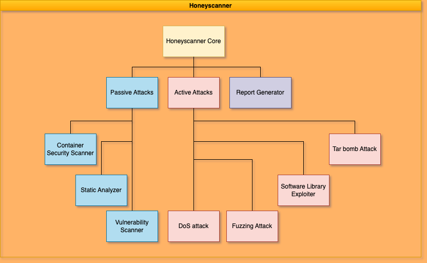

<h3>Commands to Run</h3>
<li>To Run Cowrie: /home/cowrie/cowrie/bin/cowrie start</li>
<li>To Stop Cowrie: /home/cowrie/cowrie/bin/cowrie stop</li>
<li>To Activate venv: source /home/cowrie/cowrie-env/bin/activate</li>
<li>To Run HoneyScanner: python3 /home/cowrie/honeyscanner/honeyscanner/main.py --honeypot cowrie --honeypot_version 2.5.0 --target_ip 127.0.0.1 --port 2222 --username root --password 1234</li>
<br></br>
<br></br>
# Honeyscanner - A vulnerability analyzer for Honeypots

Honeyscanner is a vulnerability analyzer for honeypots designed to automatically attack a given honeypot, in order to determine if the honeypot is vulnerable to specific types of cyber attacks. It uses a variety of attacks, ranging from exploiting vulnerable software libraries to DoS, and fuzzing attacks. The analyzer then provides an evaluation report to the honeypot administrator, offering advice on how to enhance the security of the honeypot. Targeted toward security enthusiasts, open-source communities, and companies, Honeyscanner provides a much needed safety check for various honeypots.

### Architecture

<div align="center">
    
</div>

### References

Inspiration for Honeyscanner were the following research papers.

\[1\]   [Alexander Vetterl, Richard Clayton: "Bitter Harvest: Systematically Fingerprinting Low- and Medium-interaction Honeypots at Internet Scale"](https://www.usenix.org/conference/woot18/presentation/vetterl)

\[2\]   [Shreyas Srinivasa, Jens Myrup Pedersen, Emmanouil Vasilomanolakis: "Gotta catch 'em all: a Multistage Framework for honeypot fingerprinting"](https://arxiv.org/abs/2109.10652)

\[3\]   [Shreyas Srinivasa, Dimitrios Georgoulias, Jens Myrup Pedersen, Emmanouil Vasilomanolakis: "A Bad IDEa: Weaponizing uncontrolled online-IDEs in availability attacks"](https://ieeexplore.ieee.org/document/9799405)

## Installation

The following instructions will guide you through the process of setting up Honeyscanner on your local machine.

### Requirements

- Python v3.9.12 - Required to run the project
- Pipenv v2023.7.9 - Required to install Python dependencies
- Git - Used to download the source code

---

1. Download the Honeyscanner source code from GitHub. Open a tarminal and introduce the following command.

    ```bash
    git clone https://github.com/honeynet/honeyscanner.git
    ```

2. Navigate to the Honeyscanner's folder, install the required Python packages and activate the virtual environment.

    ```bash
    cd Honeyscanner/honeyscanner
    pipenv install
    pipenv shell
    ```

> **__NOTE FOR PIPENV__:** To exit the virtual environment, you just need to enter the command "<i>exit</i>" in the terminal.

## Configuration

- Before you run Honeyscanner, you need to control or own a Honeypot instance. For testing purposes, this guide assumes that the targeted Honeypot runs on a Docker container on the local machine, where Honeyscanner runs.

- To test Honeyscanner against the latest [Cowrie](https://github.com/cowrie/cowrie) version, you can use the official Docker Image [here](https://hub.docker.com/r/cowrie/cowrie), pull it locally and run a Docker container with it.

## Usage

Use the following examples as a reference for how to run `Honeyscanner`:

```bash
python3 main.py --honeypot cowrie --honeypot_version 2.5.0 --target_ip 127.0.0.1 --port 2222 --username root --password 1234
```

